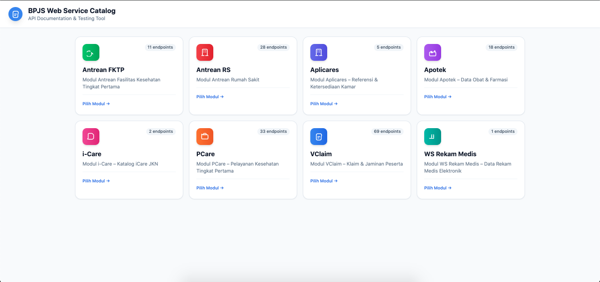
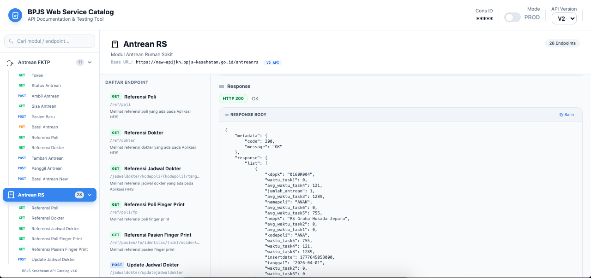

# BPJS API Web Service Catalog

A comprehensive web service catalog for BPJS Kesehatan APIs, similar to Swagger UI, built with Tailwind CSS. This application provides documentation and testing capabilities for all BPJS API modules.

## Demo





## Features

### 1. **8 BPJS API Modules**
- **Aplicares** - Hospital management services
- **VClaim** - Claims and billing services
- **Antrean RS** - Hospital queue management
- **Apotek** - Pharmacy services
- **PCare** - Primary care services
- **Antrean FKTP** - Family planning and primary care queue
- **i-Care** - Integrated care services
- **WS Rekam Medis** - Medical record services

### 2. **Dynamic API Domain Version Selection**
Implemented version switching between:
- **V1**: `apijkn.bpjs-kesehatan.go.id` (old domain)
- **V2**: `new-apijkn.bpjs-kesehatan.go.id` (new domain)

Features:
- Dropdown selector in header
- Cookie-based persistence (30 days)
- Automatic page reload on version change
- Version badge displayed on each module

**Production Base URLs:**
| Module | V1 URL | V2 URL |
|--------|--------|--------|
| VClaim | `https://apijkn.bpjs-kesehatan.go.id/vclaim-rest` | `https://new-apijkn.bpjs-kesehatan.go.id/vclaim-rest` |
| Antrean RS | `https://apijkn.bpjs-kesehatan.go.id/antreanrs` | `https://new-apijkn.bpjs-kesehatan.go.id/antreanrs` |
| Antrean FKTP | `https://apijkn.bpjs-kesehatan.go.id/antreanfktp` | `https://new-apijkn.bpjs-kesehatan.go.id/antreanfktp` |
| Apotek | `https://apijkn.bpjs-kesehatan.go.id/apotek-rest` | `https://new-apijkn.bpjs-kesehatan.go.id/apotek-rest` |
| PCare | `https://apijkn.bpjs-kesehatan.go.id/pcare-rest` | `https://new-apijkn.bpjs-kesehatan.go.id/pcare-rest` |
| i-Care | `https://apijkn.bpjs-kesehatan.go.id/ihs` | `https://new-apijkn.bpjs-kesehatan.go.id/ihs` |
| eRekamMedis | `https://apijkn.bpjs-kesehatan.go.id/erekammedis` | `https://new-apijkn.bpjs-kesehatan.go.id/erekammedis` |
| Aplicares | `https://apijkn.bpjs-kesehatan.go.id/aplicaresws/rest` | `https://new-apijkn.bpjs-kesehatan.go.id/aplicaresws/rest` |

> **Note:** Aplicares uses V1 URL in Dev mode, and V1/V2 switching in Production mode.

### 3. **Dev/Production Mode Toggle**
Toggle between development and production environments:

**Production Mode** (default):
- Uses V1 or V2 domain based on selection
- All modules use standard production URLs

**Dev Mode**:
- Uses `apijkn-dev.bpjs-kesehatan.go.id` domain
- Specific dev endpoints for each module:
  - VClaim: `/vclaim-rest-dev`
  - Antrean RS: `/antreanrs_dev`
  - Antrean FKTP: `/antreanfktp_dev`
  - Apotek: `/apotek-rest-dev`
  - PCare: `/pcare-rest-dev`
  - i-Care: `/ihs_dev`
  - eRekamMedis: `/erekammedis_dev`
  - Aplicares: Uses production domain (no dev available)
- API Version selector is disabled when Dev mode is active

### 4. **Theme Toggle**
- Dark/Light theme support
- Cookie-based persistence (30 days)

### 5. **Response Decryption**
- Automatic LZString decompression
- AES-256-CBC decryption for encrypted responses
- Manual decrypt toggle for testing

## Project Structure

```
catalog_ws_bpjs/
├── .env-demo                   # Environment variables template
├── .gitignore                  # Git ignore configuration
├── README.md                   # This documentation
├── app/
│   ├── Bootstrap.php           # Central initialization class
│   └── modules/                # BPJS API module definitions
│       ├── vclaim.php
│       ├── antrean_rs.php
│       ├── antrean_fktp.php
│       ├── apotek.php
│       ├── pcare.php
│       ├── icare.php
│       ├── ws_rekam_medis.php
│       └── aplicares.php
├── docs/                       # API documentation files
│       ├── vclaim.txt
│       ├── antreanrs.txt
│       ├── antreanfktp.txt
│       ├── apotek.txt
│       ├── pcare.txt
│       ├── icare.txt
│       ├── rekammedis.txt
│       └── aplicares.txt
├── library/                    # Third-party libraries
│   └── lz-string/              # String compression library
├── public/
│   ├── index.php               # Landing page entry point
│   ├── catalog.php             # Main application entry point
│   └── inc/
│       ├── header.php          # Reusable header component
│       └── footer.php          # Reusable footer component
├── screenshoot/                # Screenshots
│       ├── screenshoot_1.png
│       └── screenshoot_2.png
└── src/                        # Core helper classes
    ├── Decrypt.php             # AES-256-CBC decryption
    ├── Request.php             # API request handler
    └── Signature.php           # HMAC-SHA256 signature generator
```

## Setup Instructions

1. **Prerequisites**
   - XAMPP (or similar PHP server)
   - PHP 7.4 or higher

2. **Installation**
   ```bash
   # Clone or download the repository
   cd /Applications/XAMPP/xamppfiles/htdocs/catalog_ws_bpjs
   ```

3. **Configuration**
   - Copy `.env-demo` to `.env`
   - Configure your BPJS credentials in `.env`:
     ```
     BPJS_CONS_ID=your_consumer_id
     BPJS_SECRET_KEY=your_consumer_secret
     BPJS_USER_KEY=your_user_key
     ```

4. **Running the Application**
   - Start Apache and MySQL from XAMPP
   - Place the project in `htdocs/catalog_ws_bpjs`
   - Access via browser: `http://localhost/catalog_ws_bpjs/public/index.php`

## API Authentication

This application uses BPJS API authentication which includes:

1. **Signature Generation**: HMAC-SHA256 hash of the request
2. **Timestamp**: Unix timestamp for request validity
3. **Target Service**: Specific endpoint identifier
4. **Additional Headers**: User-Key and X-Timestamp

## Response Handling

API responses are automatically:
1. **Decompressed** using LZString algorithm
2. **Decrypted** using AES-256-CBC
3. **Formatted** as readable JSON

## Module Details

### Aplicares
Sub-modules:
- Referensi Kamar
- Update Ketersediaan Tempat Tidur
- Ruangan Baru
- Ketersediaan Kamar RS
- Hapus Ruangan

### VClaim
Sub-modules:
- Insert/Update/Delete LPK (Lembar Pengajuan Klaim)
- Data Lembar Pengajuan Klaim
- Monitoring Kunjungan & Klaim
- Histori Pelayanan Peserta
- Klaim Jaminan Jasa Raharja
- Peserta (by No Kartu & NIK)
- Insert/Update/Delete PRB (Rujukan Balik)
- Cari PRB
- Referensi (Diagnosa, Poli, Faskes, Dokter, Propinsi, Kabupaten, Kecamatan, Diagnosa PRB, Obat PRB, Procedure, Kelas Rawat, Dokter, Spesialis, Ruang Rawat)
- SEP (Insert, Update, Delete, Cari, Internal)
- Rujukan (Insert, Update, Delete, Cari)

### Antrean RS
Sub-modules:
- Referensi Poli & Dokter
- Jadwal Dokter
- Update Jadwal Dokter
- Tambah/Update/Ambil/Batal Antrean
- Antrean Farmasi
- Update Waktu Antrean
- Dashboard & Laporan
- Token & Status Antrean RS
- Check In & Info Pasien Baru
- Jadwal Operasi

### Apotek
Sub-modules:
- DPHO (Daftar Obat)
- Poli & Fasilitas Kesehatan
- Setting Apotek
- Spesialistik
- Obat (Referensi & Penyimpanan)
- Resep (Simpan & Hapus)
- Pendaftaran (Add, Delete)
- Peserta
- Poli FKTP
- Provider Rayonisasi
- Spesialis & Sarana
- Riwayat Pelayanan Obat

### PCare
Sub-modules:
- Diagnosa
- Dokter
- Club Prolanis
- Kegiatan & Peserta Kelompok
- Kunjungan (Add, Edit, Delete)
- MCU (Add, Edit, Delete)
- Obat (DPHO, by Kunjungan)
- Pendaftaran
- Peserta
- Poli FKTP
- Provider Rayonisasi
- Spesialis (Sub Spesialis, Sarana, Khusus)
- Faskes Rujukan

### Antrean FKTP
Sub-modules:
- Token & Status Antrean
- Ambil/Sisa Antrean
- Pasien Baru
- Batal Antrean
- Referensi Poli & Dokter
- Tambah Antrean
- Panggil/Ambil Antrean

### i-Care
Sub-modules:
- FKRTL Validate (Rumah Sakit)
- FKTP Validate (Fasilitas Kesehatan Tingkat Pertama)

### WS Rekam Medis
Sub-modules:
- Insert Medical Record

## Code Architecture

### Reusable Components

The application uses a modular architecture with reusable components:

- **`public/inc/header.php`**: Contains HTML head, CSS styles, JavaScript functions, and top header
  - Configurable via PHP variables
  - Supports dynamic title, Cons ID display, mode/version/theme toggles
  
- **`public/inc/footer.php`**: Contains sidebar navigation and main content wrapper
  - Configurable sidebar display
  - Module navigation with search
  - Form persistence via localStorage

### Entry Points

- **`public/index.php`**: Landing page showing module grid (no header controls)
- **`public/catalog.php`**: Full application with sidebar and API testing interface

## Security Notes

- Store credentials securely in `.env` file
- Never commit `.env` to version control
- Use HTTPS in production
- Keep API keys confidential

## License

This project is for educational and development purposes.

## Contributing

Feel free to submit issues and pull requests.